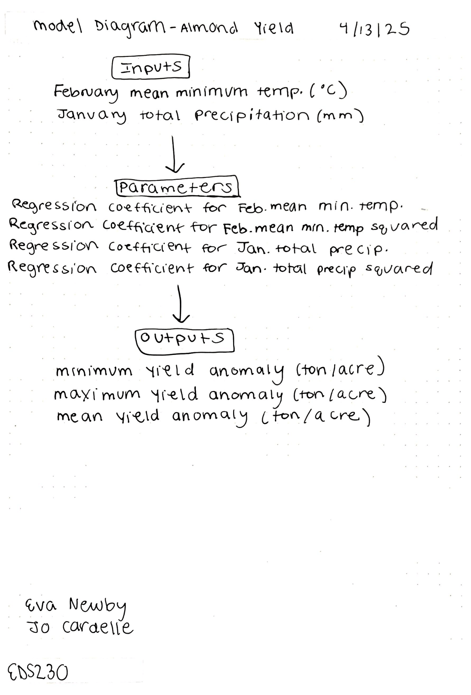

## Overview

For this assignment we'll be using the Lobell et al. (2006) almond statistical yield model. We will use this model to compute the maximum, minimum and mean yield anomalies (ton/acre) given the average minimum temperature in February (ºC) and total precipitation in January (mm).

## Diagram of Almond Yield Anomaly Model



## Load libraries

```{r}
library(here)
library(tidyverse)
```

## Source function

```{r}
source("almond_yield_function.R")
```

## Load data

```{r}
climate <- read.table(here("data/clim.txt"), header = TRUE)
```

## Process data to get climate variables

```{r}
# Filter to january and february data
feb <- climate[climate$month == 2,]
jan <- climate[climate$month ==1,]

# Create dataframe with mean min feb temps
feb_tmin_df <- feb %>% 
  group_by(year) %>% 
  summarize(feb_tmin_mean = mean(tmin_c))

# Create dataframe with total jan precips
jan_precip_df <- jan %>% 
  group_by(year) %>% 
  summarize(jan_tot_precip = sum(precip))

# Change to vectors
feb_min_temp <- feb_tmin_df$feb_tmin_mean
jan_precip <- jan_precip_df$jan_tot_precip
```

## Run model with climate variables

```{r}
# Input climate variables into function
almond_yield(feb_min_temp, jan_precip)
```
